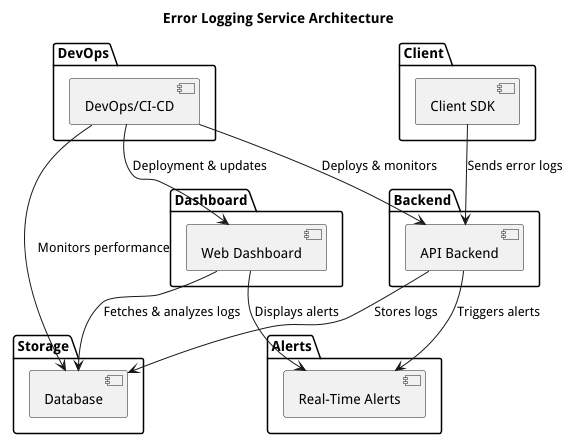

# Architecture of an Error Logging Service

## Overview

This document outlines the design for an error logging service that captures, processes, stores, and analyzes error logs
from client applications. The service comprises a client SDK, a Node.js API backend, a log storage database, a 
React-based web dashboard, and a DevOps solution for deployment, monitoring, and scaling. The design emphasizes 
real-time processing, security, and scalability while ensuring that developers have a clear, interactive interface for 
log analysis and alerting.

## System Components

### Client SDK

**Technology:** TypeScript.

**Responsibilities:**
  - Captures error logs, stack traces, and relevant metadata: user context, environment, etc. 
  - Transmits logs via HTTPS to the backend API. 
  - Provides configuration options for log levels and sampling.

**Justification:** 

A TypeScript SDK is lightweight, easily integrable with web and Node.js applications, and can be extended to support
other languages in the future.

### API Backend

**Technology:** Node.js + NestJS

**Responsibilities:**
  - Receives and validates error logs from client applications. 
  - Implements rate limiting and authentication for security. 
  - Forwards critical error logs to a messaging queue for real-time alerts. 
  - Stores processed logs into the chosen database.

**Justification:** 
Node.js offers non-blocking I/O, ideal for handling high volumes of incoming logs, and its vast ecosystem simplifies
integration with other services like rate-limiting middleware or logging libraries.

### Database

**Technology options:** 
  - **NoSQL:** Flexible document storage for unstructured log data. Elasticsearch, or similar NoSQL database.
  - **Elasticsearch:** For advanced search capabilities and real-time analytics.
  - **Time-Series DB**: If metrics over time are also tracked.

**Responsibilities:**
  - Efficiently store and index log data.
  - Support fast search queries and aggregations on log data.

**Justification:** 

NoSQL databases and Elasticsearch are well-suited for high write volumes and flexible querying, making them ideal for
log storage and retrieval.

### Web Dashboard

**Technology:** React.js with Redux or Context API for state management.

**Responsibilities:**
  - Provide an interactive interface for developers to view, filter, and search logged errors.
  - Provides visualizations of error trends, log volume, and alert status for analysis.
  - Enable drill-down capabilities to inspect individual log entries.

**Justification:**

React.js allows for fast, responsive UI updates, while Redux or Context API ensures a predictable. Also, its 
component-based architecture allows for modular, maintainable code.

### Real-Time Alerts

**Technology:** 
  - **Messaging queue:** RabbitMQ or Kafka to handle high-throughput log events.
  - **Email Service:** Integration with services like AWS SES, SendGrid, or NodeMailer.

**Responsibilities:**
  - Process critical error logs in real-time for immediate alerts.
  - Send email notifications to developers or DevOps teams for urgent issues.
  - Support configurable alerting rules based on error severity.

**Justification:** 

A message queue decouples error processing from the main API flow, ensuring that critical alerts are handled in near 
real-time without affecting overall performance.

### DevOps and Deployment

**Technology:** 
  - **Containerization:** Docker for packaging the application components.
  - **Orchestration:** Kubernetes for container management and scaling.
  - **Monitoring:** Prometheus for metrics collection and Grafana for visualization.
  - **CI/CD:** GitLab CI/CD or GitHub Actions for automated testing and deployment.
  - **Cloud Provider:** AWS, GCP, or Azure for hosting the application.

**Responsibilities:**
  - Automate testing, integration, and deployment processes.
  - Monitor system health, log processing rates, and alerting mechanisms.
  - Scale the application based on incoming log volume and traffic patterns.

**Justification:** 

Modern DevOps practices enhance reliability and speed, while container orchestration and cloud services allow the 
system to scale dynamically based on load.

---

## Architectural Diagram

> **Note:** The above diagram is a simplified overview. Actual implementations might include additional layers such as 
load balancers, API gateways, caching, and security proxies.

---

## Key Decisions and Considerations

**Real-Time Processing:**

- Use non-blocking Node.js for low-latency handling. 
- Implement message queues to decouple alert processing from the API.

**Log Retention Policies:**

- Define compliance or analysis based on client needs. 
- Consider automated pruning or archiving strategies in the database.

**Security:**

- Enforce rate limiting to prevent API abuse.
- Use HTTPS, JWR, and CORS policies.

**Scalability:**

- Use containerization and orchestration for easy scaling.
- Implement continuous monitoring and logging for operational insights.

---

## Conclusion

This proposed architecture leverages modern, scalable, and secure technologies to build an efficient error logging 
service. By addressing real-time processing, flexible storage, and interactive analysis, the design meets the core 
requirements while also providing avenues for future expansion. The system's modular components and DevOps practices 
ensure reliability, scalability, and maintainability in the long run.